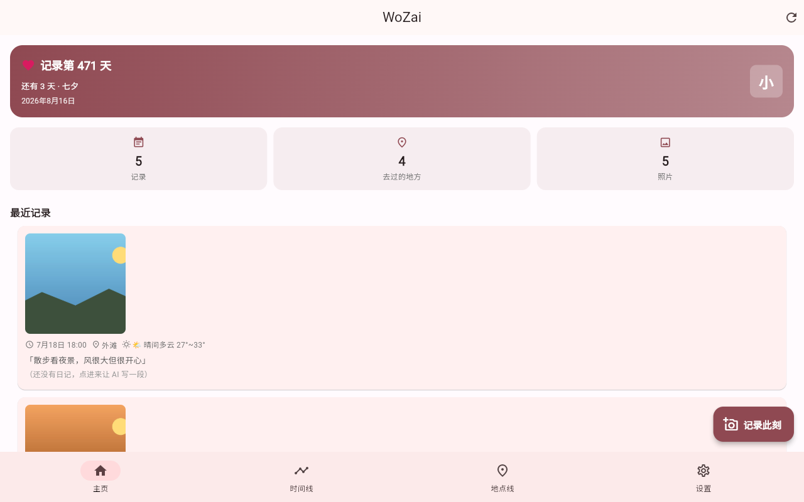
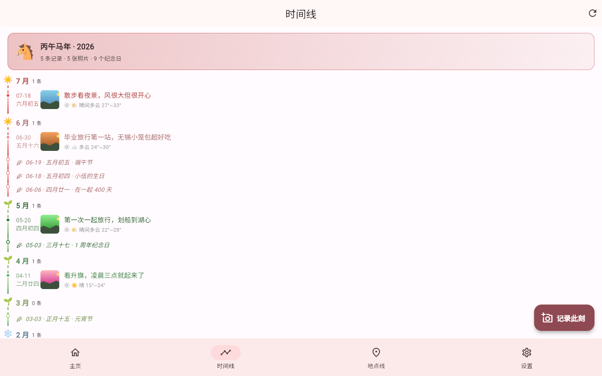
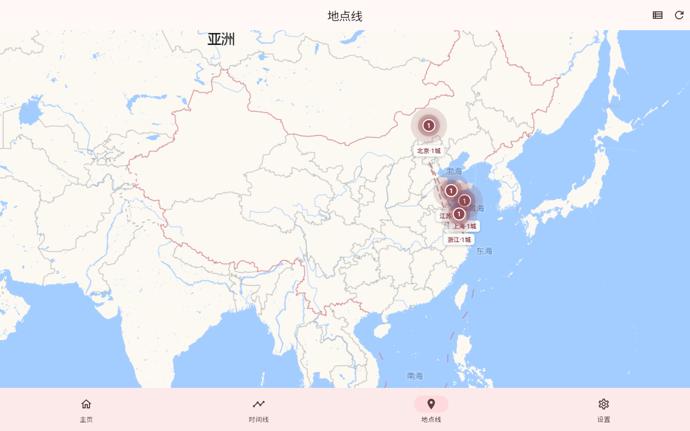
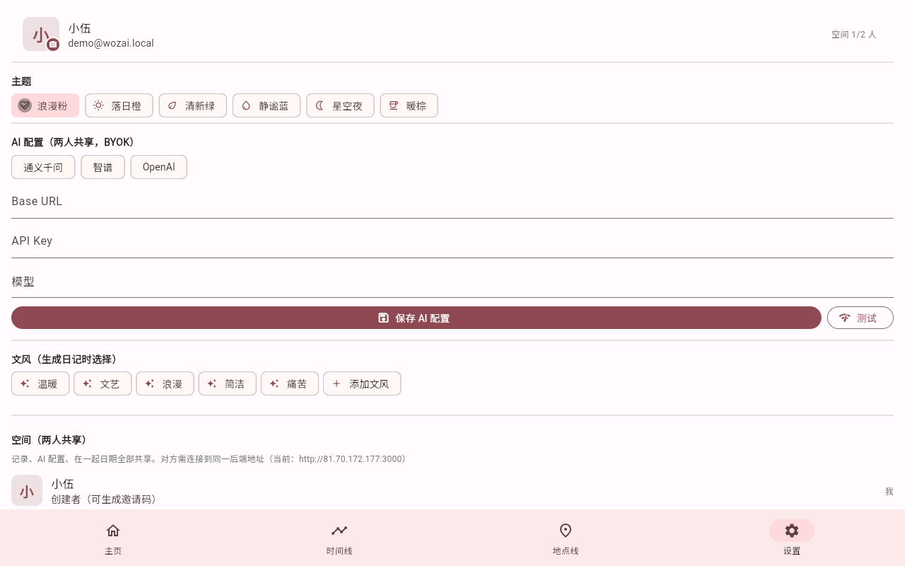

# WoZai（我在）

> 帮懒人情侣/个人记录每一天的 App —— 拍张照，AI 帮你写日记，沉淀成时间线。

**WoZai** 是一个自部署、数据私有的"懒人日记 + 时间线"应用：

- 拍一张照（或写一句话），AI 自动补齐时间、地点、照片内容，生成一段有温度的日记
- 单人可用（个人生活日记），也可以邀请另一半组成情侣空间（2 人共享同一份时间线）
- 数据完全在自己掌控下：自部署后端 + 自己的 AI API Key（BYOK）

客户端为 Flutter（Android / iOS / Web / 桌面），后端为 Node.js + TypeScript + Express + Prisma + SQLite（零数据库依赖，单文件即用）。

## 📸 预览

| 主页（在一起天数 · 最近记录） | 时间线（季节渐变 · 农历 · 天气） |
|:---:|:---:|
|  |  |

| 地点线（省→市→景点点亮地图） | 设置（主题/AI 配置/空间/纪念日） |
|:---:|:---:|
|  |  |

## ✨ 功能

- 📸 **记录事件**：多张照片（≤9 张）+ 自动定位 + 时间（可回填补记）+ 一句话备注
- 🌤️ **自动记录天气**：保存时按所选时间与地点自动获取当天天气（Open-Meteo，免 Key），时间线 / 卡片 / 详情页展示
- 🤖 **AI 生成日记**：多模态 LLM 看图 + 上下文（时间/地点/备注/天气）→ 有温度的日记；可编辑 / 重新生成 / 换文风；幻觉约束（只写照片里真实可见的事实）；模型不支持图片时自动降级纯文本模式
- 🧪 **AI 配置测试**：设置页「测试」按钮一键验证 Base URL / Key / 模型是否可用（20s 超时，错误信息直达）
- 🎨 **文风系统**：内置 温暖/文艺/浪漫/简洁/痛苦，支持自定义提示词命名保存
- 🎨 **多主题**：6 套主题（浪漫粉/落日橙/清新绿/静谧蓝/星空夜/暖棕），一键切换持久化
- ⏱ **四页导航**：
  - **主页**：在一起天数 + 下一个纪念日倒计时 + 记录统计 + 双头像（双人时丘比特射爱心动画）
  - **时间线**：按季节渐变着色的回忆流，节日 / 纪念日标记 + 农历日期
  - **地点线**：点亮地图（省 → 市 → 景点三级缩放），点击标记回看那个地方的所有回忆
  - **设置**：主题 / AI 配置 / 文风 / 空间管理 / 纪念日 / 数据导出
- 💑 **情侣空间**：邀请码加入（2 人上限），成员头像、在一起日期、AI 配置全部共享
- 🎂 **DIY 纪念日**：生日 / 毕业日 / 相识纪念日…（1900-2100），区分归属（我的 / TA 的 / 共同的），每年提醒；只可管理自己的和共同的
- 🌏 **全中文界面**：日期选择器、星期、系统组件全部本地化
- 🔑 **BYOK**：OpenAI 兼容协议，支持通义千问 / 智谱 / DeepSeek / OpenAI / MiMo 等任意兼容端点
- 📦 **数据导出**：一键导出全部事件 + 照片（ZIP）

## 🏗 架构

```
Flutter App (Android / iOS / Web / 桌面)
      │  REST API (http://IP:3000)
      ▼
Node.js + TypeScript + Express + Prisma
      │
      ├── SQLite（事件 / 日记 / 用户 / 空间）
      └── 本地文件系统（照片 / 头像）
```

- **后端**：Node ≥ 20 + TypeScript + Express + Prisma + SQLite（Prisma Migrate 管理 schema）
- **客户端**：Flutter ≥ 3.x（`app/`），开发期可直接跑 Windows 桌面 / Chrome 调试
- **部署**：轻量云直接 Node 运行（见 `deploy/`），也可 Docker 化；无需域名 / 备案 / HTTPS（IP 直连即可）

完整产品设计见 [docs/product-design.md](docs/product-design.md)。

## 🚀 快速开始（开发环境）

前置要求：

| 工具 | 版本 | 用途 |
|---|---|---|
| Node.js | ≥ 20 | 后端 |
| Flutter SDK | ≥ 3.x | 客户端 |
| Git | 任意 | 版本管理 |

```bash
# 1. 克隆
git clone https://github.com/awsl0/WoZai.git && cd WoZai

# 2. 后端
cd server
npm install
cp .env.example .env   # 按需修改端口等
npx prisma migrate deploy   # 初始化数据库（SQLite）
npm run dev            # 默认 http://localhost:3000

# 3. 客户端（开发调试，无需 Android Studio）
cd ../app
flutter pub get
flutter run -d chrome   # 或 -d windows
```

> App 首次启动需在登录页配置后端地址（如 `http://localhost:3000`），并在设置页配置 AI（BYOK）。

### 构建 Android APK

```bash
cd app
flutter build apk --release
# 产物：build/app/outputs/flutter-apk/app-release.apk
```

仓库根目录同时提供已构建的版本包：`WoZai-v1.1.apk`。

> ⚠️ 本地数据（`server/.env`、`server/prisma/dev.db`、`server/uploads/`）不随仓库同步，新环境需重新注册账号、重新配置 AI。如需迁移数据，用旧环境「设置 → 导出全部数据」或直接拷贝上述文件。

## ☁️ 部署（轻量云，生产）

推荐：直接 Node 运行 + Nginx 反代（SQLite 轻量，2GB 小内存云即可）：

```bash
# 服务器上执行（Ubuntu/Debian），一键脚本见 deploy/deploy.sh
bash deploy/deploy.sh
```

要点：

1. 上传 `server/` 到服务器（排除 `node_modules` / `dev.db` / `.env` / `uploads`）
2. 服务器 `npm install && npx prisma migrate deploy && npm run build`
3. `nohup node dist/index.js &`（或用 PM2 / systemd 守护）
4. 安全组放行 3000；Nginx 可反代 `/api` + 静态托管前端（可选）
5. 首次部署自动生成随机 `JWT_SECRET`（写入服务器 `server/.env`）

照片是核心资产，请务必为服务器配置**定期备份**（快照 / 数据盘 / 定期 rsync `server/uploads/` 与 `server/prisma/dev.db`）。

## 🔌 API 概览

| 方法 | 路径 | 说明 | 鉴权 |
|---|---|---|---|
| POST | `/api/auth/register` | 注册（自动创建个人空间） | - |
| POST | `/api/auth/login` | 登录，返回 JWT | - |
| GET | `/api/auth/me` | 当前用户 + 空间（含头像/纪念日） | ✅ |
| PUT | `/api/auth/profile` | 修改昵称 | ✅ |
| POST | `/api/auth/avatar` | 上传头像（multipart） | ✅ |
| GET | `/api/space` | 我的空间（含成员） | ✅ |
| POST | `/api/space/join` | 邀请码加入（上限 2 人；有记录则拒绝） | ✅ |
| POST | `/api/space/invite` | 重新生成邀请码（仅 owner） | ✅ |
| POST | `/api/space/transfer` | 转让空间（仅 owner） | ✅ |
| PUT | `/api/space/start-date` | 设置/清空在一起日期 | ✅ |
| PUT | `/api/space/custom-dates` | 保存 DIY 纪念日（含归属 ownerId） | ✅ |
| POST | `/api/events` | 创建事件（multipart：照片≤9张 + 时间 + 定位 + 备注 + 天气） | ✅ |
| GET | `/api/events` | 时间线（倒序，含照片） | ✅ |
| GET | `/api/events/:id` | 事件详情 | ✅ |
| PUT | `/api/events/:id` | 编辑事件（改正文/时间/地点，正文改动标记用户编辑） | ✅ |
| DELETE | `/api/events/:id` | 删除事件（连照片） | ✅ |
| POST | `/api/events/:id/generate` | AI 看图生成日记（BYOK 多模态） | ✅ |
| GET | `/api/settings/ai` | 读取 AI 配置（key 脱敏） | ✅ |
| PUT | `/api/settings/ai` | 保存 AI 配置（空间级共享） | ✅ |
| POST | `/api/settings/ai/test` | 测试 AI 配置连通性（临时配置优先） | ✅ |
| GET | `/api/export` | 导出全部事件 + 照片（ZIP） | ✅ |

## 🔑 AI 配置（BYOK）

在 App 设置 → AI 配置中填写：

| 字段 | 说明 | 示例 |
|---|---|---|
| Base URL | OpenAI 兼容端点 | `https://dashscope.aliyuncs.com/compatible-mode/v1` |
| API Key | 你的密钥 | `sk-...` |
| 模型 | 多模态模型名 | `qwen-vl-max` / `glm-4v-plus` / `gpt-4o` / `mimo-v2.5` |

设置页提供常用预设（通义 / 智谱 / OpenAI）一键填入，填完点「**测试**」验证连通性。

> **模型不支持图片？** 生成时关闭「使用照片」开关（`usePhotos:false`），自动降级为纯文本模式——只用时间/地点/备注生成，不编造画面。
>
> 隐私说明：照片与上下文会发送到你**自己配置的** AI 服务商；项目本身不收集任何数据。

## 🛡 隐私与合规

- 本项目不收集任何用户数据，全部数据存储于你的自部署实例
- 定位、照片属个人信息，部署者自行负责合规（[个人信息保护法](http://www.npc.gov.cn/npc/c30834/202108/a8c4e3672c74491a80b53a172bb753fe.shtml)）
- 更多细节见 [docs/product-design.md](docs/product-design.md) §9

## 📜 许可证

[PolyForm Noncommercial License 1.0.0](LICENSE) © 2026 LiXiang

- ✅ **允许**：个人自用、学习研究、非商业项目、慈善 / 教育 / 科研机构使用；可自由查看、修改、在自己的非商业项目里使用源码
- ❌ **禁止**：任何形式的**商业用途**（直接或间接营利、商业化经营此服务、拿它赚钱），商用需另行单独授权
- 📌 分发或传播源码时须保留本许可声明

> 💼 商业授权通道见 [COMMERCIAL.md](COMMERCIAL.md)（商用请先联系获授权）

## 🗺 路线图

- [x] 产品设计（v0.2）
- [x] 后端脚手架：Express + Prisma + SQLite + 注册登录 + 空间/邀请码（含 CI）
- [x] 事件 CRUD + 照片上传 + AI 看图生成日记 + 转让/日期/导出
- [x] 客户端骨架：登录/时间线/记录/事件详情/设置
- [x] 地点线：省→市→景点三级点亮地图 + 点击回看记录
- [x] 情侣空间：邀请码 / 头像 / 在一起日期 / 纪念日归属
- [x] 天气记录、AI 配置测试、日期选择器中文化、年份放宽到 1900
- [x] Android APK 打包（v1.1）
- [ ] 主页头像遮挡修复（见 [docs/bugs/TODO.md](docs/bugs/TODO.md)）
- [ ] iOS 打包上架、Android 应用商店发布
